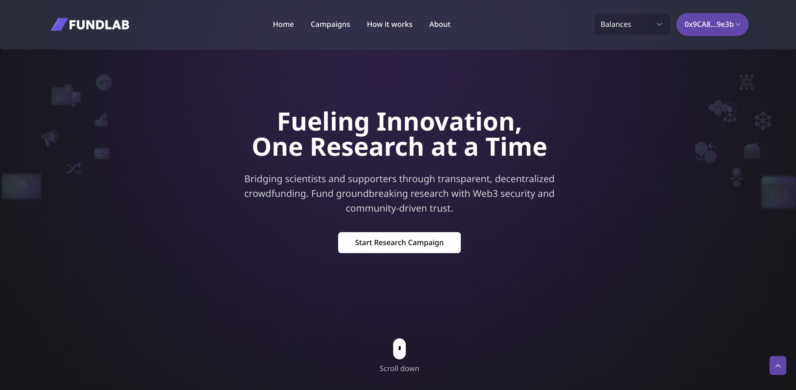

# FundLab


## Bridging scientists and supporters through transparent, decentralized crowdfunding

FundLab is a Web3-powered platform that connects researchers with global supporters to fund groundbreaking scientific research through transparent, decentralized crowdfunding.



## Table of Contents

- [Overview](#overview)
- [Features](#features)
- [Technology Stack](#technology-stack)
- [Architecture](#architecture)
- [Smart Contracts](#smart-contracts)
- [Contributing](#contributing)
- [License](#license)

## Overview

FundLab revolutionizes research funding by leveraging blockchain technology to create a transparent, efficient, and accessible platform for scientists and supporters. Our mission is to democratize access to research funding while ensuring accountability through smart contracts and community-driven verification.

The platform enables researchers to create campaigns for their projects, set funding goals and milestones, and receive support through cryptocurrency or fiat payments. Supporters can browse campaigns, contribute funds, and track the progress of research projects they've backed.

## Features

### For Researchers

- **Campaign Creation**: Easily create and manage research funding campaigns
- **Milestone-Based Funding**: Set clear research milestones that trigger fund releases
- **Verification System**: AI-powered and community verification for project authenticity
- **Multiple Funding Options**: Accept funding through crypto, fiat, or NFTs
- **Transparent Reporting**: Share progress updates with supporters

### For Supporters

- **Discover Research**: Browse and filter campaigns by category, funding goal, or timeline
- **Secure Contributions**: Contribute to campaigns using various payment methods
- **Track Progress**: Monitor the progress of funded research projects
- **Community Engagement**: Participate in discussions and verification processes
- **Impact Measurement**: See the real-world impact of your contributions

### Platform Features

- **Smart Contract Integration**: Automated fund distribution based on milestone completion
- **Web3 Authentication**: Secure wallet-based authentication
- **Responsive Design**: Optimized experience across desktop and mobile devices
- **Real-time Updates**: Live campaign statistics and funding progress
- **Decentralized Governance**: Community participation in platform decisions

## Technology Stack

### Frontend
- **Framework**: Next.js 13+ (App Router)
- **Language**: TypeScript
- **State Management**: Recoil
- **Styling**: Tailwind CSS
- **UI Components**: Custom components with Radix UI primitives
- **Web3 Integration**: web3-react, ethers.js

### Backend
- **Smart Contracts**: Solidity
- **Blockchain**: Ethereum (with support for multiple chains)
- **Storage**: IPFS for decentralized content storage
- **APIs**: RESTful endpoints for non-blockchain data

### DevOps
- **CI/CD**: GitHub Actions
- **Hosting**: Vercel
- **Testing**: Jest, React Testing Library

## Architecture

FundLab follows a modern, decentralized architecture that combines the best of Web2 and Web3 technologies:

```
┌─────────────────┐     ┌─────────────────┐     ┌─────────────────┐
│                 │     │                 │     │                 │
│  Next.js App    │────▶│  Smart          │────▶│  Blockchain     │
│  (Frontend)     │     │  Contracts      │     │  Networks       │
│                 │     │                 │     │                 │
└────────┬────────┘     └─────────────────┘     └─────────────────┘
         │                                                ▲
         │                                                │
         ▼                                                │
┌─────────────────┐     ┌─────────────────┐     ┌────────┴────────┐
│                 │     │                 │     │                 │
│  Web3 Provider  │────▶│  Wallet         │────▶│  Transaction    │
│  Context        │     │  Connection     │     │  Processing     │
│                 │     │                 │     │                 │
└─────────────────┘     └─────────────────┘     └─────────────────┘
```

The application uses a component-based architecture with the following key modules:

- **Campaign Management**: Handles creation, updating, and display of campaigns
- **Authentication**: Manages wallet connections and user sessions
- **Payment Processing**: Facilitates contributions to campaigns
- **Verification System**: Implements the AI and community verification process
- **Notification System**: Keeps users updated on campaign progress

## Smart Contracts

FundLab's core functionality is powered by smart contracts deployed on the Ethereum blockchain. The main contracts include:

### CampaignFactory

Responsible for creating and managing campaign contracts. It handles:
- Campaign creation
- Campaign listing
- Campaign verification

### Campaign

Individual campaign contracts that manage:
- Funding collection
- Milestone tracking
- Fund distribution
- Campaign status updates

### TokenRegistry

Manages the supported tokens for campaign contributions:
- Token whitelisting
- Token price feeds
- Token conversion rates

## Contributing

We welcome contributions to FundLab! Please follow these steps:

1. Fork the repository
2. Create a feature branch: `git checkout -b feature/my-feature`
3. Commit your changes: `git commit -m 'Add some feature'`
4. Push to the branch: `git push origin feature/my-feature`
5. Open a pull request

Please make sure your code follows our coding standards and includes appropriate tests.

## License

FundLab is licensed under the MIT License. See the [LICENSE](LICENSE) file for details.

## Contact

For questions or support, please reach out to:
- Email: support@fundlab.io
- Twitter: [@FundLabOfficial](https://twitter.com/FundLabOfficial)
- Discord: [FundLab Community](https://discord.gg/fundlab)